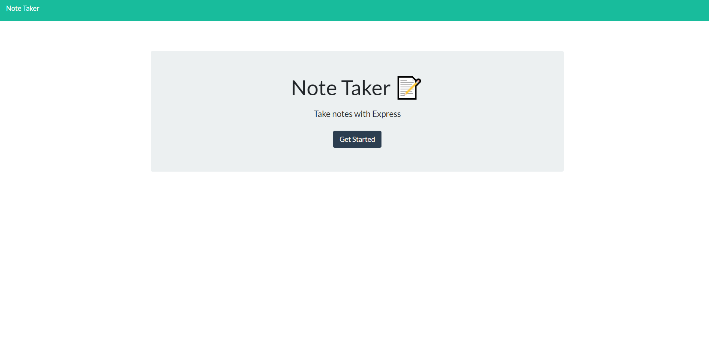

# Z Note Taker

_Click image below for live application_

## _Table of Contents_
* Description
* How to Use

## **Description**
Here is an application for replacing all of your sticky notes. Go through make a note, check old notes, and delete your notes when you are finished with them.

## **How to Use**
* Once on the main page, click `Get Started`. 
* Click the `+` in the top right corner.
* Wala! You can now start typing your notes up with a title and description below it.